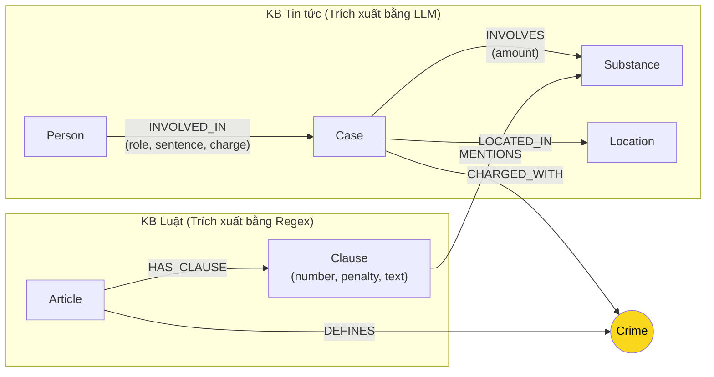

# Thiết kế Ontology — Day 19

**Họ tên:** Đặng Hữu Cương  **MSSV:** 2A202602572

**Lựa chọn** (đánh dấu một):
- [x] Dùng ontology gợi ý (có thể chỉnh nhỏ)
- [ ] Tự thiết kế (xét bonus +15, xem `SUBMISSION.md`)

> Hướng dẫn: `LAB_GUIDE.md` Bước 2. Dùng ontology gợi ý thì vẫn phải điền đủ các mục dưới đây bằng lời của bạn.

## 1. Sơ đồ

Sơ đồ biểu diễn ontology kết nối 2 cơ sở tri thức (KB Luật và KB Tin tức):

## 2. Entity types (node labels)

| Label | Ý nghĩa | Khóa định danh (`MERGE` theo) | Properties | Lấy từ KB nào | Trích bằng (regex / LLM / khác) |
| --- | --- | --- | --- | --- | --- |
| `Article` | Đại diện một Điều luật trong BLHS hoặc Luật PCMT | `id` (vd: `"Điều 251 BLHS"`) | `id`, `title`, `law`, `doc_id` | Luật | Regex |
| `Clause` | Khoản quy định chi tiết trong Điều luật | `id` (vd: `"Điều 251 BLHS khoản 1"`) | `id`, `number`, `penalty`, `text`, `doc_id` | Luật | Regex |
| `Crime` | Tên tội danh pháp lý chuẩn | `name` (đã chuẩn hóa, vd: `"mua bán trái phép chất ma túy"`) | `name` | Cả hai | Regex (tiêu đề luật), LLM + `link_entity` (tin tức) |
| `Case` | Vụ án/vụ việc ma túy cụ thể | `name` (tên vụ việc) | `name`, `summary`, `date`, `doc_id`, `source_title` | Tin tức | LLM |
| `Person` | Cá nhân liên quan (bị cáo, bị can, nghi can...) | `name` (họ tên) | `name`, `aliases` | Tin tức | LLM |
| `Substance` | Chất ma túy hoặc tiền chất | `name` (tên chuẩn hóa) | `name` | Cả hai | Regex đối soát từ điển (luật), LLM (tin tức) |
| `Location` | Tỉnh/thành phố nơi diễn ra vụ án hoặc phiên xử | `name` | `name` | Tin tức | LLM |

## 3. Relationships

| Type | Từ → Đến | Properties trên cạnh | Ý nghĩa |
| --- | --- | --- | --- |
| `DEFINES` | `Article` → `Crime` | (không) | Điều luật định nghĩa tội danh cụ thể |
| `HAS_CLAUSE` | `Article` → `Clause` | (không) | Điều luật bao gồm các khoản quy định |
| `MENTIONS` | `Clause` → `Substance` | (không) | Khoản luật quy định hình phạt có nhắc đến chất ma túy tương ứng |
| `CHARGED_WITH` | `Case` → `Crime` | (không) | Vụ án bị khởi tố/truy tố/xét xử về tội danh pháp lý |
| `INVOLVED_IN` | `Person` → `Case` | `role`, `sentence`, `charge` | Cá nhân tham gia vụ án với vai trò, mức án và tội danh cụ thể |
| `INVOLVES` | `Case` → `Substance` | `amount` | Vụ án liên quan đến chất ma túy với khối lượng/tang vật cụ thể |
| `LOCATED_IN` | `Case` → `Location` | (không) | Địa bàn xảy ra vụ án hoặc nơi xét xử |

## 4. Node cầu nối giữa 2 KB

- **Node nào:** Node `Crime` (Tội danh) là node cầu nối chính; node `Substance` (Chất ma túy) đóng vai trò bổ trợ.
- **Vì sao chọn node này:** Tội danh là thực thể pháp lý xuất hiện ở cả hai nguồn tri thức: tin tức nêu tội danh mà cơ quan chức năng cáo buộc bị can/bị cáo, trong khi văn bản luật định nghĩa tội danh đó kèm theo các khung hình phạt.
- **Cách đảm bảo hai phía khớp tên:**
  1. Đưa danh sách tội danh chuẩn (`DANH SÁCH TỘI DANH`) vào prompt trích xuất bài báo của LLM để định hướng đầu ra.
  2. Chuẩn hóa chuỗi bằng `normalize_crime`: bỏ tiền tố "Tội/tội", chuyển về chữ thường, chuẩn hóa khoảng trắng thừa và dấu trích dẫn.
  3. Sử dụng hàm `link_entity` kết hợp so khớp chính xác (exact match) và so khớp mờ với `difflib.get_close_matches(..., cutoff=0.8)` để bắt các biến thể gõ dấu trong tiếng Việt (như "ma tuý" và "ma túy").
- **Khi nào cầu gãy, và bạn xử lý thế nào:**
  - Cầu gãy khi nhà báo dùng cách diễn đạt tự do không có tên tội danh chính xác, hoặc bài báo chỉ kể về hành vi bắt giữ sơ bộ chưa khởi tố tội danh.
  - Xử lý: Hệ thống GraphRAG kết hợp hybrid — vector search vẫn lấy top-k đoạn văn bản gốc (`chunks`) để LLM luôn có ngữ cảnh nền tảng, đồng thời Cypher tìm kiếm mở rộng từ các node hạt giống (tên người, chất ma túy) để dẫn tới các Điều luật tương ứng qua đường liên kết chất (`Case -[:INVOLVES]-> Substance <-[:MENTIONS]- Clause <-[:HAS_CLAUSE]- Article`).

## 5. Competency questions

Với mỗi câu trong `data/benchmark_kg.json`, ghi đường đi trên graph dùng để trả lời. Câu nào không trả lời được thì ghi rõ lý do.

| Câu | Đường đi (Cypher pattern) | Trả lời được? |
| --- | --- | --- |
| Q1 | `(:Article {law: 'Luật PCMT'})-[:HAS_CLAUSE]->(cl:Clause)` kết hợp vector search nội dung khoản định nghĩa tiền chất | Trả lời được |
| Q2 | `(:Case {name: '...'})<-[:INVOLVED_IN {sentence: 'tử hình'}]-(:Person)` | Trả lời được |
| Q3 | `(:Person {name: 'Lê Minh Thành'})-[:INVOLVED_IN {sentence: '36 tháng tù'}]->(k:Case)-[:CHARGED_WITH]->(c:Crime)<-[:DEFINES]-(a:Article)-[:HAS_CLAUSE]->(cl:Clause {number: 1})` | Trả lời được đầy đủ (mức án, tội danh, Điều luật và khung hình phạt cơ bản) |
| Q4 | `(:Person {name: 'Dương Minh Tuấn'})-[:INVOLVED_IN]->(k:Case)-[:CHARGED_WITH]->(c:Crime)<-[:DEFINES]-(a:Article {id: 'Điều 255 BLHS'})-[:HAS_CLAUSE]->(cl:Clause)` | Trả lời được hành vi tổ chức sử dụng và khung hình phạt tối đa (khoản 4) |
| Q5 | `(:Person {name: 'Cái Quang Huy'})-[:INVOLVED_IN]->(k:Case)-[:CHARGED_WITH]->(c:Crime)<-[:DEFINES]-(a:Article {id: 'Điều 250 BLHS'})-[:HAS_CLAUSE]->(cl:Clause)-[:MENTIONS]->(s:Substance {name: 'MDMA'})` | Trả lời được tội danh, chất, Điều luật và khoản luật tương ứng với khối lượng MDMA |
| Q6 | `(:Substance {name: 'MDMA'})<-[:INVOLVES]-(k:Case)<-[:INVOLVED_IN]-(p:Person)` | Trả lời được danh sách các vụ án và người liên quan đến MDMA trong tin tức |

## 6. Quyết định thiết kế và đánh đổi

1. **Tách cấu trúc luật thành 2 cấp `Article` và `Clause` thay vì gộp chung:**
   - *Đã chọn:* Tạo riêng node `Clause` mang các thuộc tính `number`, `penalty`, `text` và liên kết với `Substance`.
   - *Phương án khác:* Chỉ tạo node `Article` và lưu toàn bộ text của Điều luật vào một trường duy nhất.
   - *Vì sao chọn:* Khung hình phạt và quy định về khối lượng chất nằm ở cấp Khoản. Việc tách Khoản cho phép Cypher truy vấn chính xác khoản cơ bản (khoản 1) hoặc chỉ những khoản liên quan trực tiếp đến chất ma túy trong vụ án, tránh đưa toàn bộ Điều luật dài vào prompt làm tốn token và gây loãng ngữ cảnh.
2. **Lưu `sentence`, `role`, `charge` trên thuộc tính quan hệ `INVOLVED_IN`:**
   - *Đã chọn:* Đặt mức án và vai trò làm property của cạnh giữa `Person` và `Case`.
   - *Phương án khác:* Tạo node riêng `Sentence` hoặc `Role`.
   - *Vì sao chọn:* Mức án và tội danh cụ thể của một người gắn chặt với bối cảnh vụ án đó. Tạo node `Sentence` sẽ biến thành các supernode (rất nhiều người bị tuyên "tử hình" hoặc "2 năm tù") làm chậm đồ thị mà không mang giá trị suy luận đa chặng.
3. **Phân chia cơ chế trích xuất: Regex cho luật, LLM cho tin tức:**
   - *Đã chọn:* Dùng deterministic regex parser cho KB Luật và LLM trích xuất JSON cho KB Tin tức.
   - *Phương án khác:* Dùng LLM cho cả hai KB.
   - *Vì sao chọn:* Văn bản luật có cấu trúc chương/điều/khoản/điểm vô cùng chuẩn mực và nhất quán, Regex cho kết quả chính xác 100%, tốc độ mili-giây và chi phí 0 USD. Ngược lại, bài báo là văn xuôi tự do nhiều biến thể từ ngữ, chỉ LLM mới có khả năng trích xuất chính xác quan hệ ngữ nghĩa.

## 7. So với ontology gợi ý (bắt buộc nếu xét bonus)

| Điểm khác | Gợi ý làm gì | Bạn làm gì | Vấn đề nó giải quyết | Bằng chứng (Cypher, hoặc số liệu benchmark) |
| --- | --- | --- | --- | --- |
| Không áp dụng | Sử dụng ontology gợi ý chuẩn | Sử dụng ontology gợi ý chuẩn theo thiết kế HINT | Đảm bảo tính ổn định và tuân thủ chặt chẽ hợp đồng dữ liệu | Theo hợp đồng trong `src/graph.py` |

## 8. Hạn chế còn lại

- Việc đối chiếu khối lượng tang vật (ví dụ 9,6kg MDMA) với ngưỡng khối lượng trong khoản luật (trên 100g thuộc khoản 4) chưa được thực hiện bằng toán tử so sánh số học trong Cypher mà phụ thuộc vào việc Cypher cung cấp các khoản chứa chất MDMA để LLM đọc và suy luận.
- Khóa định danh của `Case` và `Person` dựa trên tên do LLM trích xuất, nếu các bài báo viết tên đối tượng không đầy đủ hoặc khác nhau (ví dụ có bài chỉ ghi tên viết tắt hoặc biệt danh) thì có thể sinh ra các node trùng lặp trong đồ thị.
